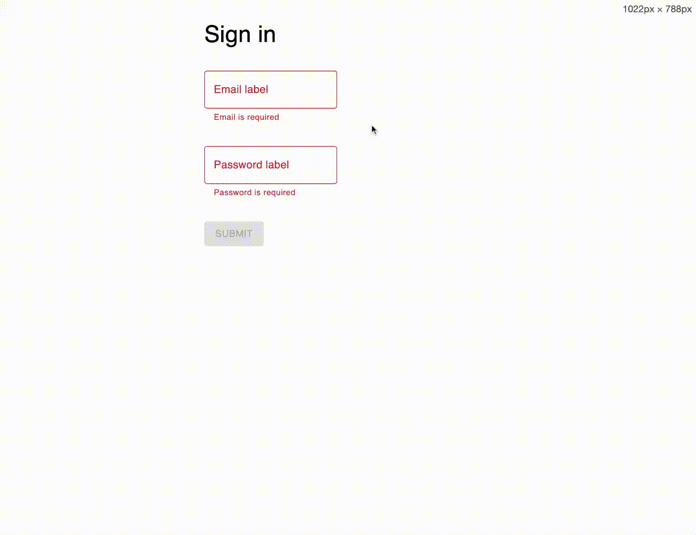

#easy-text-update
This library offers a simple way to update text in a React Application.



## Installation

```bash
npm install easy-text-update
or
yarn add easy-text-update
```

## Setup

```javascript
import { TextUpdateProvider } from "easy-text-update";

const App = () => {
  return (
    <TextUpdateProvider
      text={text} // An object containing the text necessary in the UI
      active={session.user.role === "Admin"} // A boolean value that determines if the text should be updatable
      save={(updatedText) => sendToApiEndpoint(text)} // A function that will be called when the text is updated. You can handle the saving of the text here
    >
      <App />
    </TextUpdateProvider>
  );
};
```

## Usage with HOC

```javascript
import { UpdatableText } from "easy-text-update";

const Component = () => (
  <>
    // With child
    <UpdatableText path="Homepage.title">
      <h1 style={{ color: "blue" }} /> // All props will be passed to the child
      component. The text will be passed as the children prop
    </UpdatableText>
    // With component prop
    <UpdatableText
      path="Homepage.title"
      component={<h1 style={{ color: "blue" }} />}
    />
    // With function as child
    <UpdatableText path="Homepage.title">
      {(title) => <h1>{title}</h1>}
    </UpdatableText>
    // Without child (a span will be used)
    <UpdatableText path="Homepage.title" />
  </>
);
```

## Usage with hook

```javascript
import { useUpdatableText } from "easy-text-update";

const Component = () => {
  const { text, props } = useUpdatableText("Homepage.title");
  return (
    <>
      <h1>{title}</h1>{" "}
      {/*You can access the text this way, but no editing will be possible*/}
      <h1 {...props} /> {/*When you right click the h1 element, a dialog will open to edit the text*/}
    </>
  );
};
```

## Usage with hooks to get access to an object within the text

```javascript
import { useUpdatableTextContainer } from "easy-text-update";

const Component = () => {
  const { getText, getProps } = useUpdatableTextContainer("Homepage.form");
  return (
    <>
      <label {...getProps("email.label")} />
      <input
        placeholder={getText("email.placeholder")}
        {...getProps("email.placeholder", {
          returnChildren: false,
        })}
      />
    </>
  );
};
```

In the example above, the getProps function accepts a second parameter of type `UseUpdatableTextConfig` which has the following properties:

- `returnChildren`: A boolean value that determines if the children prop should be added to the element. Defaults to true
- `innerHtml`: A boolean value that determines if the innerHtml prop should be added to the element. Defaults to false.
- `triggerEvent`: A string value that determines which event should trigger the dialog. Defaults to "onContextMenu". Accepted events are: `onClick, onContextMenu, onDoubleClick, onMouseEnter, onMouseOver`

Both `useUpdatableText` and `useUpdatableTextContainer`, as well as the `getProps` function returned by `useUpdatableTextContainer` accept a second parameter of type `UseUpdatableTextConfig`.
If the config object is not passed, it will be inherited.
For example, if you pass the config object to `useUpdatableTextContainer`, all the `getProps` functions returned by it will inherit the config object.

## Example with Material UI Input

```javascript
/*
Text object example:
{
Signup: {
    title: "Sign up",
    inputs: {
      email: {
        label: "Email label",
        placeholder: "johndoe@mail.com",
        validation: {
          email: "Email is invalid",
          required: "Email is required",
        },
      },
    }
}
*/

import { useUpdatableTextContainer } from "easy-text-update";

const Input = ({ name, tPath, xs = 6, ...rest }: Props) => {
  const { getText, getProps } = useUpdatableTextContainer(tPath);

  const error = formState.errors[name];

  return (
    <Grid item xs={xs}>
      <TextField
        error={!!error}
        label={<span {...getProps("label")} />}
        placeholder={getText("placeholder")}
        helperText={
          error ? <span {...getProps(`validation.${error.type}`)} /> : undefined
        }
        {...rest}
        inputProps={{
          ...rest?.inputProps, // copy over any inputProps
          ...getProps("placeholder", {
            // this enables editing the placeholder
            returnChildren: false,
          }),
        }}
      />
    </Grid>
  );
};

const Page = () => {
  return <Input name="email" tPath="Signup.inputs.email" />;
};
```

## Saving the text

When the text is updated, the `save` function passed to the `TextUpdateProvider` will be called with the updated text object.
You can handle the saving of the text in this function the way you want. Since the text object is a plain javascript object, you can save it to a database or a file; it's up to you.
