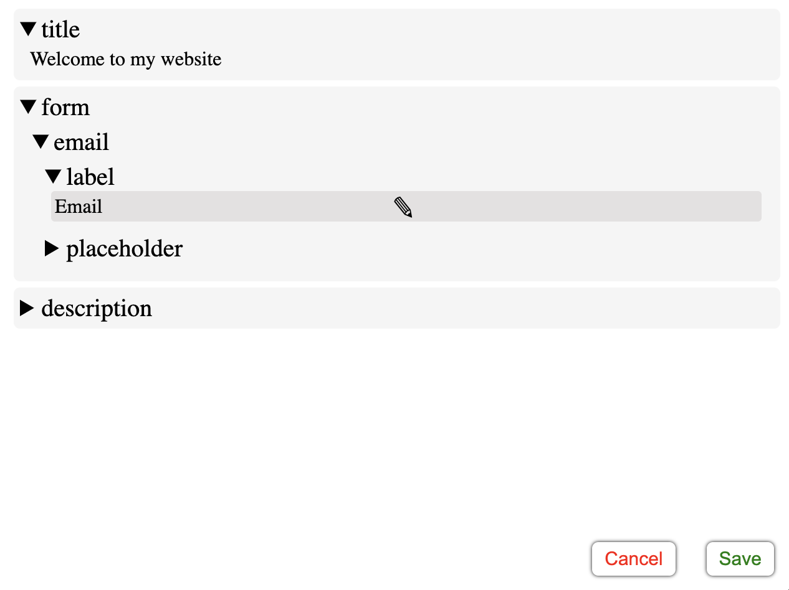

# easy-text-update

This library offers a simple way to update text in a React Application.

It provides a context provider that wraps your application and either hooks or an HOCs.
If `active={true}` is passed to the context provider, when you right click on a text element, a dialog will open to edit the text.


## Installation

```bash
npm install easy-text-update
or
yarn add easy-text-update
```

## Setup

```javascript
import { TextUpdateProvider, TextObject, RevertFn } from "easy-text-update";
import axios from "axios";

const sendToApiEndpoint = (textObject: TextObject, revert: RevertFn) => {
  axios
    .post("/api/text-update", textObject)
    .then(() => {
      // Handle success
    })
    .catch(() => {
      // Handle error
      revert();
    });
};

const App = ({ Component }) => {
  const { data: textObject } = useSWR("/api/text", fetcher); // Fetch the text object from an API endpoint. Or import it from a file
  return (
    <TextUpdateProvider
      text={textObject} // An object containing the text necessary in the UI
      active={session.user.role === "Admin"} // A boolean value that determines if the text should be updatable
      save={sendToApiEndpoint} // A function that will be called when the text is updated. You can handle the saving of the text here
    >
      <Component />
    </TextUpdateProvider>
  );
};
```

## editMenuComponent

If you want a custom edit menu, you can pass it to the TextUpdateProvider as the `editMenuComponent` prop. The component will receive the following props:

```typescript
  initialText: string;
  save: (updatedText: string) => void;
  closeMenu: () => void;
```

Example:

```javascript
import { TextUpdateProvider, EditMenuComponentProps } from "easy-text-update";
import { useRef } from "react";

const Menu = ({ initialText, save, closeMenu }: EditMenuComponentProps) => {
  const ref = useRef<HTMLInputElement>();
  return (
    <dialog open>
      <input ref={ref} defaultValue={initialText} />
      <button onClick={closeMenu}>Close</button>
      <button onClick={() => save(ref.current.value)}>Save</button>
    </dialog>
  );
};

function App() {
  return (
    <TextUpdateProvider
      text={text}
      active={true}
      save={console.log}
      editMenuComponent={Menu}
    >
      <Component />
    </TextUpdateProvider>
  );
}
```

## Usage with HOC

```javascript
import { UpdatableText } from "easy-text-update";

const Component = () => (
  <>
    {/*With child*/}
    <UpdatableText path="Homepage.title">
      <h1 style={{ color: "blue" }} />
      {/*All props will be passed to the child
      component. The text will be passed as the children prop*/}
    </UpdatableText>

    {/*With function as child*/}
    <UpdatableText path="Homepage.title">
      {(title, editProps) => <h1 {...editProps}>{title}</h1>}
    </UpdatableText>

    {/*With component prop*/}
    <UpdatableText
      path="Homepage.title"
      component={<h1 style={{ color: "blue" }} />}
    />

    {/*With component function*/}
    <UpdatableText
      path="Homepage.title"
      component={(text, editProps) => <h1 {...editProps}>{text}</h1>}
    />

    {/*With JSX element as component prop*/}
    <UpdatableText
      path="Homepage.title"
      component={<h1 style={{ color: "blue" }} />}
    />

    {/*Without child (a span will be used)*/}
    <UpdatableText path="Homepage.title" />
  </>
);
```

## Usage with hook

```javascript
import { useUpdatableText } from "easy-text-update";

const Component = () => {
  const { text, props } = useUpdatableText("Homepage.title");
  return (
    <>
      <h1>{title}</h1>{" "}
      {/*You can access the text this way, but no editing will be possible*/}
      <h1 {...props} /> {/*When you right click the h1 element, a dialog will open to edit the text*/}
    </>
  );
};
```

## Usage with hooks to get access to an object within the text object passed to the TextUpdateProvider

```javascript
import { useUpdatableTextContainer } from "easy-text-update";

const Component = () => {
  const { getText, getProps } = useUpdatableTextContainer("Login.form");
  return (
    <>
      <label {...getProps("email.label")} />
      <input
        placeholder={getText("email.placeholder")}
        {...getProps("email.placeholder", {
          returnChildren: false,
        })}
      />
    </>
  );
};
```

In the example above, the getProps function accepts a second parameter of type `UseUpdatableTextConfig` which has the following properties:

- `returnChildren`: A boolean value that determines if the children prop should be added to the element. Defaults to true. For input and textarea elements, this prop will always be false, therefore it can be omitted.
- `innerHtml`: A boolean value that determines if the innerHtml prop should be added to the element. Defaults to false.
- `triggerEvent`: A string value that determines which event should trigger the dialog. Defaults to "onContextMenu". Accepted events are: `onClick, onContextMenu, onDoubleClick, onMouseEnter, onMouseOver`

Both `useUpdatableText` and `useUpdatableTextContainer`, as well as the `getProps` function returned by `useUpdatableTextContainer` accept a second parameter of type `UseUpdatableTextConfig`.
If the config object is not passed, it will be inherited.
For example, if you pass the config object to `useUpdatableTextContainer`, all the `getProps` functions returned by it will inherit the config object.

## Example with Material UI Input

```javascript
/*
Text object example:
{
Signup: {
    title: "Sign up",
    inputs: {
      email: {
        label: "Email label",
        placeholder: "johndoe@mail.com",
        validation: {
          email: "Email is invalid",
          required: "Email is required",
        },
      },
    }
}
*/

import { useUpdatableTextContainer } from "easy-text-update";
import { useFormContext } from "react-hook-form";

const Input = ({ name, tPath, ...rest }: Props) => {
  const { getText, getProps } = useUpdatableTextContainer(tPath);
  const { formState } = useFormContext(); // react-hook-form, but you can use any form library

  const error = formState.errors[name];

  return (
    <TextField
      error={!!error}
      label={<span {...getProps("label")} />}
      placeholder={getText("placeholder")} // pass this as a string
      helperText={
        // this accepts a string or a JSX element
        // if you want the label to be editable, you can pass it as a child
        error ? <span {...getProps(`validation.${error.type}`)} /> : undefined
      }
      {...rest} // pass the rest of the props
      inputProps={{
        ...rest?.inputProps, // copy over any inputProps
        ...getProps("placeholder", {
          // this enables editing the placeholder
          returnChildren: false,
        }),
      }}
    />
  );
};

const Page = () => {
  return <Input name="email" tPath="Signup.inputs.email" />;
};
```

## One admin page for all the texts

The EditTextPage component can be used as a central page where you can edit your text object.

Example with React Router:

```javascript
import { TextUpdateProvider, EditTextPage } from "easy-text-update";
import { BrowserRouter, Routes, Route } from "react-router-dom";

// Better to import this from a JSON file or from a database
const text = {
  title: "Hello World",
  form: {
    email: {
      label: "Email",
      placeholder: "Enter your email",
    },
  },
  description: "A lot of amazing stuff in here!!!",
};

function App() {
  return (
    <BrowserRouter>
      <TextUpdateProvider text={text} active save={console.log}>
        <Routes>
          <Route path="edit" element={<EditTextPage title="Text Admin" />} />
          {/* Your other routes */}
        </Routes>
      </TextUpdateProvider>
    </BrowserRouter>
  );
}

export default App;
```

You can pass `onInactive` and `onSave` props to `EditTextPage` to handle the inactive state and the save action. By default, on inactive, null will be returned. For the save action, the save function passed to `TextUpdateProvider` will be called.

## Or build your own text admin page

Use the `useEditTextPageContext` to get access to the text object, the active value and the save function.

```javascript
import { useEditTextPageContext } from "easy-text-update";
import { useEffect } from "react";

const EditTextPage = () => {
  const { textObject, active, save } = useEditTextPageContext();

  useEffect(() => {
    if (!active) {
      // Redirect or whatever
    }
  }, [active]);
  
  return <>Amazing stuff here</>;
};
```

## Saving the text

When you click "Save" the text is updated in the UI, and the `save` function provided to `TextUpdateProvider` is called with the updated text object.
In the save function you can handle the saving of the text the way you want. Since the text object is a plain javascript object, you can send it to the backend and save it to a database or a file.
If the update fails, you can call the revert callback provided to your save function as the second parameter. This will revert the text to the previous state in the UI.
